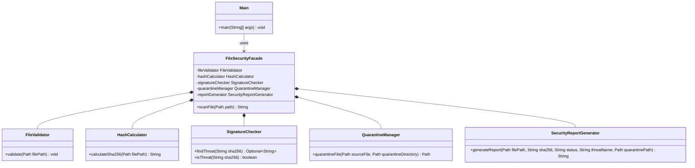

# UML Class Diagram

```mermaid
classDiagram
    class Main {
        +main(String[] args) void
    }

    class FileSecurityFacade {
        -fileValidator FileValidator
        -hashCalculator HashCalculator
        -signatureChecker SignatureChecker
        -quarantineManager QuarantineManager
        -reportGenerator SecurityReportGenerator
        +scanFile(Path path) String
    }

    class FileValidator {
        +validate(Path filePath) void
    }

    class HashCalculator {
        +calculateSha256(Path filePath) String
    }

    class SignatureChecker {
        +findThreat(String sha256) Optional~String~
        +isThreat(String sha256) boolean
    }

    class QuarantineManager {
        +quarantineFile(Path sourceFile, Path quarantineDirectory) Path
    }

    class SecurityReportGenerator {
        +generateReport(Path filePath, String sha256, String status, String threatName, Path quarantinePath) String
    }

    Main --> FileSecurityFacade : uses
    FileSecurityFacade *-- FileValidator
    FileSecurityFacade *-- HashCalculator
    FileSecurityFacade *-- SignatureChecker
    FileSecurityFacade *-- QuarantineManager
    FileSecurityFacade *-- SecurityReportGenerator
```
